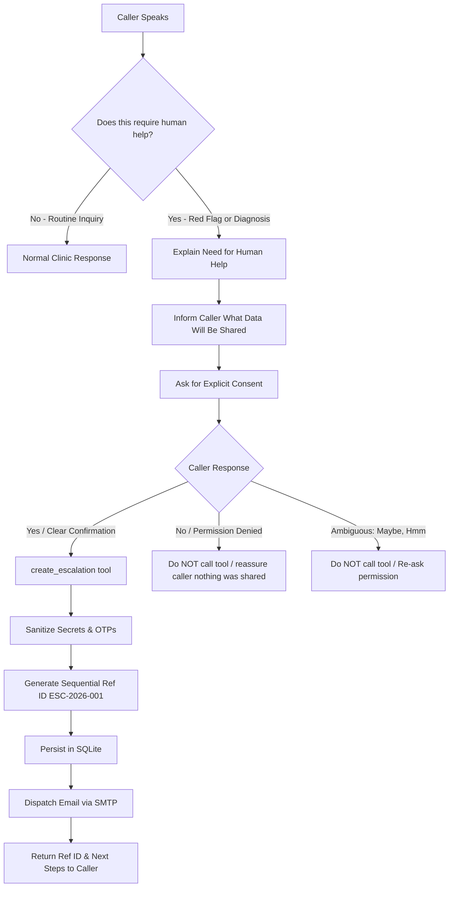

# Voice Agent Starter — Powered by Murf Falcon

Build a production voice AI agent in 5 minutes. Powered by the fastest TTS on the market - swap the system prompt to build anything from customer support to language tutors.

[](https://opensource.org/licenses/MIT) [](https://murf.ai/api/docs/text-to-speech/streaming) [](https://docs.livekit.io) [](https://www.typescriptlang.org/) [](https://www.python.org/)

---

## Why Murf Falcon

- **55ms model latency** - fastest production TTS
- **130ms time-to-first-audio** across 10+ global regions
- **$0.01/1000 characters** - up to 10x cheaper than alternatives
- **150+ voices** across 35+ languages
- **99.38% pronunciation accuracy**

---

## Architecture


---

## Quickstart

### Prerequisites

- **Python** 3.10+
- **[uv](https://docs.astral.sh/uv/)** - fast Python package manager
  ```bash
  # macOS/Linux
  curl -LsSf https://astral.sh/uv/install.sh | sh
  # Windows (PowerShell)
  powershell -ExecutionPolicy ByPass -c "irm https://astral.sh/uv/install.ps1 | iex"
  ```
- **Node.js** 18+
- **pnpm** — fast Node package manager
  ```bash
  npm install -g pnpm
  ```
- A [LiveKit](https://cloud.livekit.io/) project (free tier available)

### Step 1: Clone the repo

```bash
git clone https://github.com/murf-ai/murf-livekit-starter.git
cd murf-livekit-starter
```

### Step 2: Set up environment variables

Create `.env.local` in both `backend/` and `frontend/` (copy from `.env.example` in each). You need:

| Variable                               | Where to get it                                        | Required |
| -------------------------------------- | ------------------------------------------------------ | -------- |
| `LIVEKIT_URL`                          | LiveKit Cloud dashboard                                | Yes      |
| `LIVEKIT_API_KEY`                      | LiveKit Cloud dashboard                                | Yes      |
| `LIVEKIT_API_SECRET`                   | LiveKit Cloud dashboard                                | Yes      |
| `MURF_API_KEY`                         | [murf.ai/api/dashboard](https://murf.ai/api/dashboard) | Yes      |
| `DEEPGRAM_API_KEY`                     | [deepgram.com](https://deepgram.com)                   | Yes      |
| `GOOGLE_API_KEY` (or `OPENAI_API_KEY`) | Depends on LLM choice                                  | Yes      |

### Step 3: Install backend dependencies

```bash
cd backend
uv sync
uv run python src/agent.py download-files
```

### Step 4: Install frontend dependencies

```bash
cd frontend
pnpm install
```

### Step 5: Run it

**Option A - All-in-one (from repo root):**

```bash
# macOS/Linux
chmod +x start_app.sh
./start_app.sh

# Windows (PowerShell)
.\start_app.ps1
```

**Option B - Separate terminals:**

```bash
# Terminal 1 — LiveKit Server
livekit-server --dev

# Terminal 2 — Backend agent
cd backend && uv run python src/agent.py dev

# Terminal 3 — Frontend
cd frontend && pnpm dev
```

Then open **http://localhost:3000** in your browser.

You should now see the voice agent UI. Click **Start talking**, allow microphone access, and speak — the agent will respond with Murf Falcon TTS. Ensure your backend and (if using Option B) LiveKit server are running.

---

## Deploy

Want to deploy this beyond localhost? You'll need to deploy **two services**: the backend agent and the frontend. Both must use the same LiveKit project.

> This is a two-service app — the backend agent and the frontend UI deploy separately. You'll need both running and connected to the same LiveKit project.

### Backend (Python agent) — Deploy to Railway

[](https://railway.com/deploy/tIVCF1?referralCode=cNjn2P&utm_medium=integration&utm_source=template&utm_campaign=generic)

Set these environment variables in Railway:

- `MURF_API_KEY`
- `DEEPGRAM_API_KEY`
- `GOOGLE_API_KEY` or `OPENAI_API_KEY`
- `LIVEKIT_URL`
- `LIVEKIT_API_KEY`
- `LIVEKIT_API_SECRET`

The backend runs as a long-lived Python process that connects to LiveKit as an agent. Railway handles this well.

### Frontend (Next.js) — Deploy to Vercel

[](https://vercel.com/new/clone?repository-url=https://github.com/murf-ai/murf-livekit-starter&root-directory=frontend&env=LIVEKIT_URL,LIVEKIT_API_KEY,LIVEKIT_API_SECRET&project-name=murf-voice-agent&repository-name=murf-voice-agent)

Set these environment variables in Vercel:

- `LIVEKIT_URL`
- `LIVEKIT_API_KEY`
- `LIVEKIT_API_SECRET`
- `AGENT_NAME` (optional — for explicit agent dispatch)

The frontend is a standard Next.js app. Point it at the same LiveKit instance your backend agent is connected to.

### Connecting them

The frontend and backend don't call each other directly — they both connect to **LiveKit**, which handles the real-time audio transport.

1. Use the **same** `LIVEKIT_URL`, `LIVEKIT_API_KEY`, and `LIVEKIT_API_SECRET` on both Railway and Vercel
2. Set `AGENT_NAME=my-agent` on Vercel — this matches the `agent_name="my-agent"` registered in `backend/src/agent.py`
3. Verify: Railway logs should show the agent connected to LiveKit. Open your Vercel URL, click **Start talking** — the agent should respond

If the agent doesn't connect, double-check that both services point to the same LiveKit project and that the backend is running (check Railway logs).

---

## Change the Use Case

The default system prompt makes this a **customer support agent**. You can change the agent’s behavior by editing the prompt.

**Where the prompt lives:** `backend/src/agent.py`- the `SYSTEM_PROMPT` constant (near the top of the file, after the imports). Change that string to change what your voice agent does.

### Example prompts (copy-paste)

**Customer Support (default):**

```
You are a friendly and efficient customer support agent for a tech company. Help users with account issues, billing questions, and product troubleshooting. Be concise, empathetic, and solution-oriented. If you don't know something, say so honestly and offer to escalate.
```

**Language Tutor:**

```
You are a patient and encouraging language tutor helping the user practice conversational Spanish. Speak primarily in Spanish but switch to English to explain grammar or vocabulary when needed. Correct mistakes gently and suggest better phrasing. Keep conversations natural and fun.
```

**AI Receptionist:**

```
You are a professional receptionist for a medical clinic. Help callers schedule appointments, answer questions about office hours and services, and take messages for doctors. Be warm but efficient. Ask for the caller's name and reason for calling upfront.
```

See the Configuration section below for voice, STT, and LLM options.

---

## Configuration

### Murf voice

Edit the `tts=murf.TTS(...)` call in `backend/src/agent.py`. Set the `voice` argument to any Murf voice ID. Examples:

- `Anisha` — Indian English (female, default in this starter)
- `Pooja` — Indian English (female)
- `Samar` — Indian English (male)
- `Amara` — US English (female)
- `Gordon` — US English (male)
- `Hazel` — UK English (female)
- `Bertie` — UK English (male)

Browse all voices: [Murf Voice Library](https://murf.ai/api/docs/voices-styles/voice-library).

### STT provider

STT is configured in `backend/src/agent.py` in the `AgentSession(stt=...)` call. The default is Deepgram (`deepgram.STT(model="nova-3")`). You can swap to another LiveKit-compatible STT plugin if needed.

### LLM (Gemini vs OpenAI)

- **Gemini (default):** Set `GOOGLE_API_KEY` and use `llm=google.LLM(model="gemini-3.5-flash-lite")` in `agent.py`.
- **OpenAI:** Set `OPENAI_API_KEY`, add the OpenAI plugin, and use the corresponding `llm=openai.LLM(...)` in `agent.py`.

### Audio format

Murf Falcon and LiveKit handle audio format internally. For advanced options, see [Murf API docs](https://murf.ai/api/docs) and [LiveKit docs](https://docs.livekit.io).

---

## Project Structure

```
murf-livekit-starter/
├── backend/                 # Python voice agent (LiveKit Agents + Murf Falcon)
│   ├── src/
│   │   └── agent.py         # Agent entrypoint, pipeline (STT/LLM/TTS), system prompt
│   ├── tests/               # Agent tests
│   ├── .env.example         # Backend env template
│   ├── pyproject.toml       # Python deps (uv)
│   └── railway.toml         # Railway deploy config
├── frontend/                # Next.js UI for voice sessions
│   ├── app/
│   │   ├── page.tsx         # Main page
│   │   └── api/token/       # LiveKit token endpoint (dev)
│   ├── components/          # UI (agents-ui, app config, theme)
│   ├── app-config.ts        # Branding, title, button text, accent
│   ├── .env.example         # Frontend env template
│   └── package.json         # Node deps (pnpm)
├── start_app.sh             # Start LiveKit + backend + frontend (macOS/Linux)
├── start_app.ps1            # Start LiveKit + backend + frontend (Windows)
├── README.md                # This file
```

For deeper documentation on each part, see:

- [Backend Documentation](./backend/README.md) — agent pipeline, voice/LLM/STT configuration, testing, deployment
- [Frontend Documentation](./frontend/README.md) — UI customization, visualizers, theming, component architecture

---


## Day 5 – Healthcare Tools

For Day 5, SehatSaathi was enhanced with healthcare-specific
function tools that allow the voice agent to fetch domain data
and perform basic safety triage.

### Healthcare Facility Lookup

SehatSaathi can search for healthcare facilities based on
a city, district, or locality.

The agent uses:

- `find_nearby_healthcare_facility`
- `check_triage_level`

### Data Source

The healthcare facility lookup currently uses a **local CSV
dataset** containing 100 healthcare facility records.

The data is stored locally in:

`backend/data/healthcare_facilities.csv`

This is **not a live government API or external real-time
data source**.

Each facility record contains an update date, allowing the
agent to communicate when the available information was last
updated.

### Safety and Failure Handling

The agent does not invent healthcare facility information.

If:

- the requested facility is not found, or
- the healthcare data source is unavailable,

the agent provides a graceful response instead of generating
an unverified facility, address, phone number, or availability.

### Triage Tool

The `check_triage_level` tool performs a basic safety
triage classification based on predefined emergency
red-flag symptoms.

It is not a diagnostic tool and does not recommend
medications or dosages.

For detected emergency symptoms, the agent advises the
caller to call 108 or go to the nearest hospital.

### Day 5 Tools

1. `find_nearby_healthcare_facility`
   - Searches the local healthcare facility dataset.
   - Returns available facility information.
   - Reports the dataset update date.

2. `check_triage_level`
   - Checks for predefined emergency red flags.
   - Returns an emergency or routine triage level.
   - Provides a safe next-step response.

### Day 5 Advanced Flow

SehatSaathi can chain healthcare tools during a conversation.

For example:

User describes severe chest pain
→ `check_triage_level`
→ Emergency detected
→ User asks for a nearby hospital
→ `find_nearby_healthcare_facility`
→ Healthcare facility information is returned.

### Day 5 Status

- [x] Healthcare facility lookup
- [x] Local healthcare dataset
- [x] Tool-based function calling
- [x] Failure handling
- [x] Data freshness information
- [x] Emergency triage
- [x] Natural voice responses
- [x] Tool chaining

---

## Day 7 – Know When to Ask for Human Help (Human Escalation via Email)

In Day 7 of the **10 Days of AI Voice Agents** challenge (**Health Access Track**), SehatSaathi is taught to recognize clinical boundaries, refuse diagnostic claims, and escalate high-risk or diagnostic scenarios to human healthcare professionals via **SMTP Email** with strict, explicit user consent and privacy sanitization.



### 1. Two Escalation Triggers

1. **Trigger 1 — Red-Flag Emergency Symptoms**
   - *Examples*: Severe chest pain, breathing difficulty, sudden numbness/stroke symptoms, heavy bleeding, loss of consciousness.
   - *Flow*: Automatically runs `check_triage_level` -> Delivers immediate emergency advice (Call 108 / Visit Emergency Room) -> Offers human support escalation as an additional workflow.
2. **Trigger 2 — Diagnosis Requests**
   - *Examples*: *"Can you diagnose me?"*, *"Mujhe batao mujhe kaunsi bimari hai"*, *"What disease do I have?"*
   - *Flow*: Explicitly refuses to diagnose as an AI -> Explains human medical expertise is required -> Offers to create a human support request.

### 2. Mandatory Permission & Consent Flow

The agent **never** creates an escalation or shares data without explicit user permission.
- **Pre-Escalation Disclosure**: Explains what will be shared (summary, urgency, language, preferred follow-up method) and what will **never** be shared (OTPs, passwords, PINs, bank details).
- **Clear Affirmation**: Only `"Yes"`, `"Yes, please"`, `"Go ahead"`, `"हाँ, बना दीजिए"` triggers `create_escalation()`.
- **Ambiguous Replies**: Words like `"Maybe"`, `"Hmm"`, `"Okay"` do NOT trigger the tool; the agent asks for clarification.
- **Denial**: Replying `"No"` immediately prevents data sharing, and the agent explicitly confirms nothing was sent.

### 3. Tool: `create_escalation`

- **Parameters**: `reason`, `summary`, `what_agent_checked`, `urgency` (`EMERGENCY` | `HIGH` | `MEDIUM` | `LOW`), `language`, `preferred_followup`.
- **Reference ID**: Auto-generates clean, collision-free sequential IDs formatted as `ESC-2026-001`, `ESC-2026-002`, etc.
- **Persistence**: SQLite database table `escalations` (`backend/data/memory.db`).
- **Privacy Sanitization**: Redacts 4–8 digit OTPs, PINs, passwords, card numbers, and API tokens prior to storage or email dispatch.

### 4. Email Notification Format

Notifications are dispatched directly to the human support inbox using standard SMTP:

**Subject**: `[SehatSaathi] Human Escalation — ESC-2026-001 — EMERGENCY`

**Body**:
```text
SEHATSAATHI HUMAN ESCALATION REQUEST

Reference ID:
ESC-2026-001

Reason:
Red-Flag Symptom

Urgency:
EMERGENCY

Summary:
Caller reported severe chest pain and difficulty breathing.

What the Agent Checked:
Existing triage identified the symptoms as potentially urgent.

Language:
Hindi

Preferred Follow-up:
Phone

Status:
OPEN

Created At:
12 August 2026, 18:30 UTC
```

### 5. Environment Setup for Email (SMTP)

Add your SMTP configuration to `backend/.env.local`:
```env
ESCALATION_EMAIL_TO=human-support@example.com
ESCALATION_EMAIL_FROM=voice-agent@example.com
SMTP_HOST=smtp.gmail.com
SMTP_PORT=587
SMTP_USERNAME=your_email@gmail.com
SMTP_PASSWORD=your_app_password
```

### 6. Running Tests

Run the Day 7 test suite:
```bash
cd backend
uv run pytest tests/test_escalation.py -v
```

## Day 8 – Call Analytics Dashboard

Day 8 enhances SehatSaathi with a real-time Call Analytics Dashboard. It provides a visual interface for metrics and logs that are stored and updated in the existing SQLite database.

### 1. Success & Failure Definition
* **Success**: A call is classified as successful if it reaches a useful health-service outcome. This is signaled by the successful execution of core action tools (`create_escalation`, `find_nearby_healthcare_facility`, `record_medication_intake`, `schedule_followup_reminder`, `opt_out_patient`, `save_caller_memory`) or when keyword and pattern analysis confirms a successful clinical query or safe health guidance was provided.
* **Failure**: A call is classified as failed if it ends before reaching a success condition (e.g. user hangs up early, silence timeout / no response, incomplete tasks, or operational errors).

### 2. Database Integration
The existing SQLite database is modified with a new table `call_analytics` containing:
- `call_id` (Unique LiveKit room name)
- `caller_id` (Masked identifier for privacy)
- `call_mode` (browser, inbound, outbound)
- `language` (Hindi, English, Gujarati, Unknown)
- `start_time`, `end_time` (ISO timestamps)
- `duration` (Calculated duration in seconds)
- `status` (initiated, in_progress, completed)
- `outcome` (success, failed)
- `success_reason` (SAFE_GUIDANCE, HUMAN_ESCALATION, CLINIC_INFORMATION)
- `failure_reason` (USER_HANGUP, INCOMPLETE_TASK, TOOL_FAILURE, API_ERROR, NO_RESPONSE, SILENCE_TIMEOUT)

### 3. Caller Privacy
Strict caller identity masking is implemented inside `mask_caller_id()` to comply with HIPAA/GDPR rules:
- Browser-based users are logged and displayed as `Browser User`.
- Telephone and SIP caller numbers are masked: e.g. `+919876543210` -> `+91******3210`.
- No medical logs, API keys, SMTP passwords, or transcripts are stored in analytics.

### 4. Running the Dashboard
1. The backend runs standard livekit workers.
2. The Next.js frontend fetches database metrics dynamically from the `/api/analytics` endpoint.
3. Open `http://localhost:3000/dashboard` in your browser to view the real-time metrics, auto-refresh toggles, failure breakdowns, and recent call histories.

### 5. Running Tests
Run the entire test suite, including the call analytics tests:
```bash
cd backend
uv run pytest tests/
```

## Day 9 – Multi-Agent Handoff System

Day 9 introduces a production-quality multi-agent handoff architecture powered by LiveKit Agents. The system separates broad healthcare reception and safety governance from deep clinic appointment workflows while keeping context unified.

### 1. Multi-Agent Architecture
- **Main Agent (Anisha)**: Acts as the primary conversational interface, healthcare guidance agent, and safety/triage/routing authority.
- **Clinic & Appointment Specialist**: Narrow-responsibility specialist handling clinic timings, doctor schedules, appointment bookings, rescheduling, cancellations, and status lookups.
- **Bidirectional Handoff**: The Main Agent hands off to the Clinic Specialist via `transfer_to_clinic_specialist()`, and the Specialist hands back via `handback_to_main_agent()` when out-of-scope health queries or completed workflows occur.

### 2. Context Preservation (`HandoffContext`)
When transferring between agents, structured context is passed without repeating requests or passing raw transcripts:
- User Intent / Request
- Doctor preference (e.g. Dr. Sharma, Dr. Priya Sharma, Dr. Rajesh Patel)
- Requested date & preferred time slot
- Spoken language (Hindi Devanagari / English)
- Relevant consented memory
- Strict privacy filters (passwords, PINs, OTPs, cards, and full transcripts are excluded)

### 3. Explicit Handoff State Model & Loop Guard
States: `MAIN`, `HANDOFF_REQUESTED`, `SPECIALIST_ACTIVE`, `TASK_COMPLETED`, `HAND_BACK_TO_MAIN`, `HANDOFF_FAILED`.
Loop prevention tracks transition counts and enforces limits to prevent ping-pong transitions.

### 4. Safety First (Safety > Specialist Routing)
Emergency red-flags (chest pain, breathlessness, heavy bleeding) or diagnosis requests are NEVER routed directly to the appointment specialist. The Main Agent immediately executes safety triage (`check_triage_level`) and the Day 7 human escalation protocol. If the specialist detects safety issues, it hands back to Main Agent immediately.

### 5. Running Day 9 Tests
```bash
cd backend
uv run pytest tests/
```
All 43 unit and integration tests validate routing, context preservation, handback, safety priority, privacy sanitization, and specialist appointment tools.

---

## Links

- [Murf API Docs](https://murf.ai/api/docs)
- [Murf Voice Library](https://murf.ai/api/docs/voices-styles/voice-library)
- [LiveKit Docs](https://docs.livekit.io)
- [Deepgram Docs](https://developers.deepgram.com)
- [Murf Falcon Benchmarks](https://murf.ai/falcon/benchmarks)
- [TTS Latency Benchmarker](https://github.com/sahilsgupta/tts-latency-benchmarker) — run your own p50/p95 tests across providers
- [Murf Discord](https://discord.gg/FbKAy96Sz7)
- [Murf Startup Incubator](https://murf.ai/api) — 50M free characters for startups

---

## License

MIT

